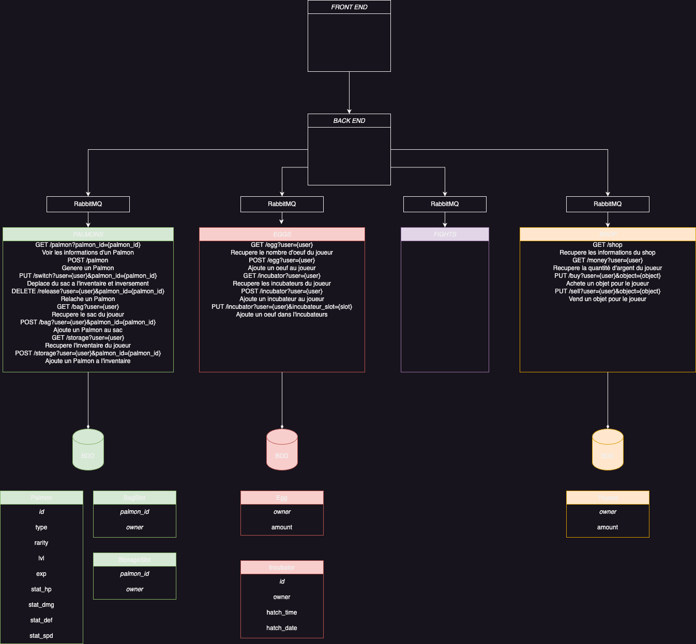

# 🐙 PalMon

The game complete all requierements for evaluation (RabbitMQ queues are implemented only on service "eggs"). But there is no full game loop as you can't get eggs that are obtainable in "adventure map" wich is not implemented yet. To test everything, we invite you to use cheat codes described at the end of the README file :)  
### [You have a demo here: https://palmon.chades.fr/](https://palmon.chades.fr/)

# ⚙️ Setup

Clone this repo
> git clone https://github.com/ChadEstoupStreiff/PalMon.git  
> cd PalMon  

Copy .env.exemple and edit .env with your values
> cp .env.exemple .env  
> vim .env  

Edit front end config with your values
> vim front/src/assets/js/config.js  

Launch with docker compose
> docker-compose up -d --build

# ⁉️ Troubleshot

If the loading screen on your web app is infinite, consider restarting micro-services (palmon_service_eggs, palmon_service_palmons, palmon_service_shop), they try to connect to DB to soon.

# 🔥 Cheats
Open your JS console and here is some usefull function:
- Give yourself as many eggs as you want
> cheat_eggs(quantity: int)  

- Give yourself as many dollars as you want
> cheat_dollars(amount: int)  

- Give yourself as many palmon as you want (in storage)
> cheat_palmon(quantity: int)  

- Force a hatch from an interdimensional incubator
> cheat_hatch()  

